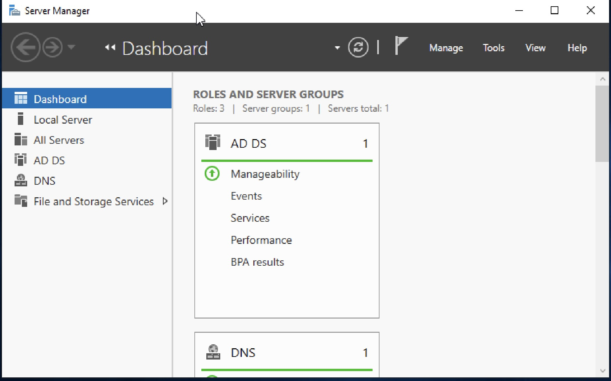
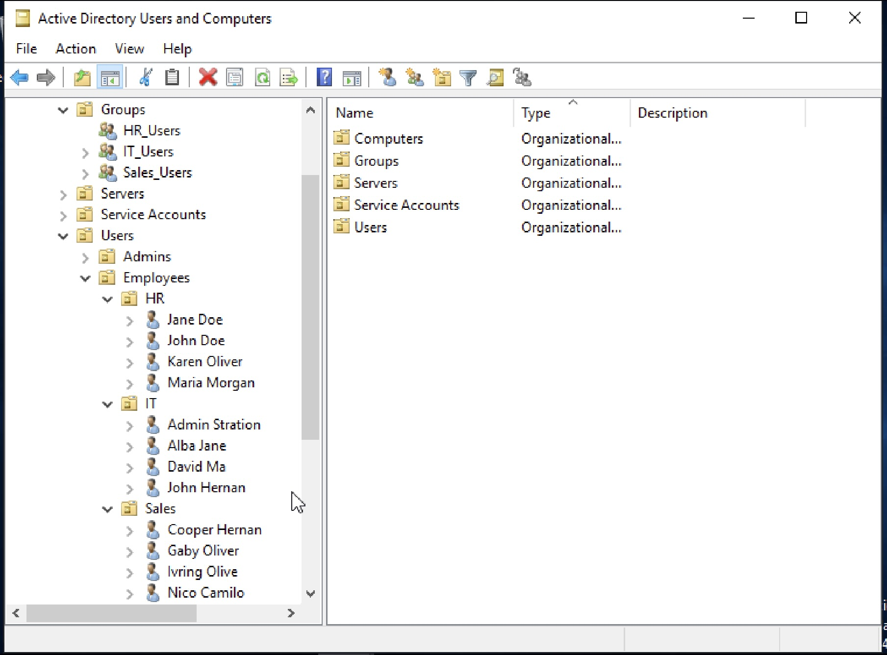
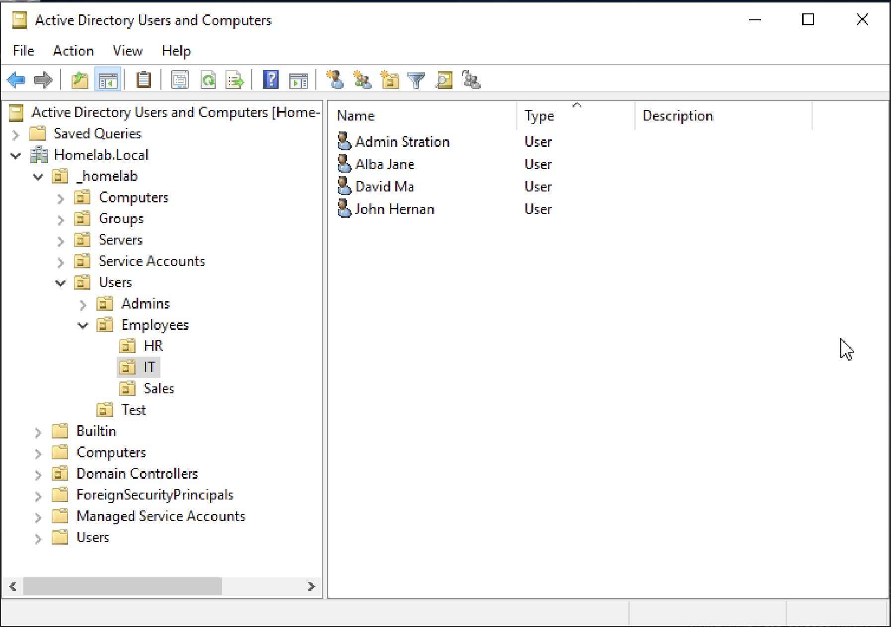
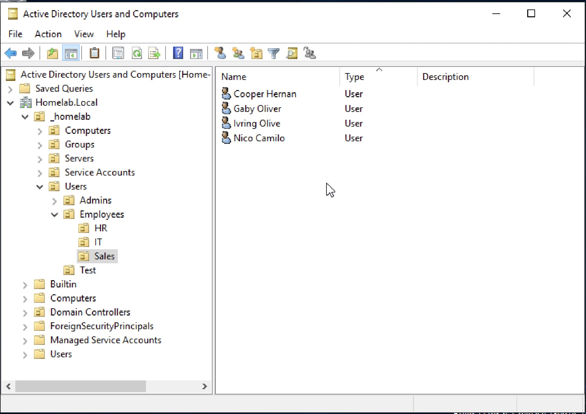
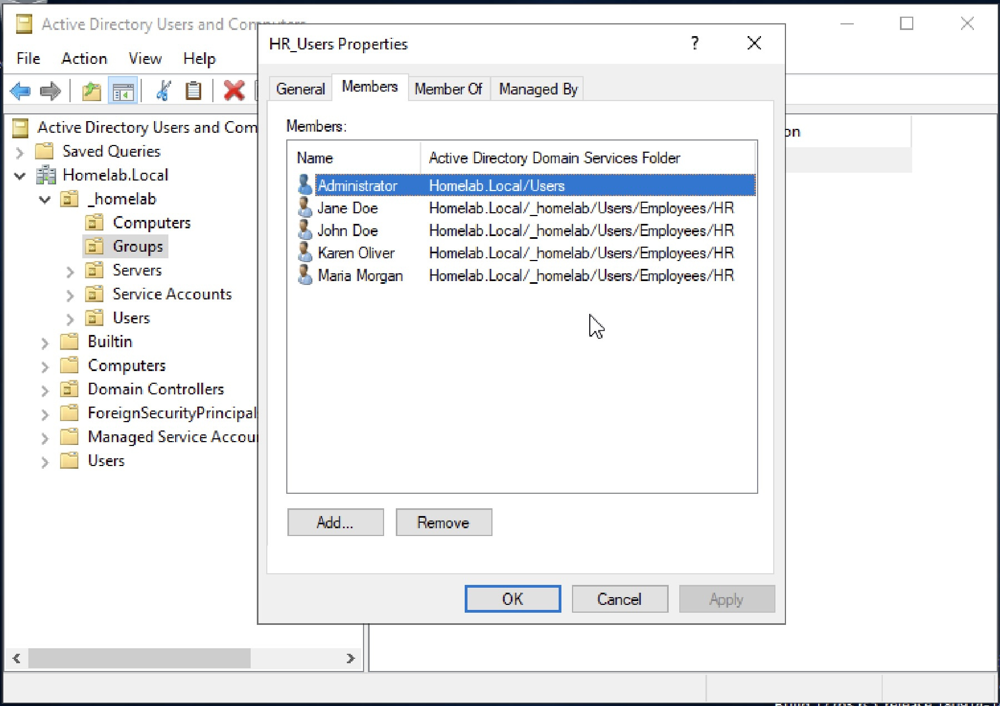

# Active Directory User & Group Management Lab

## Objective
Build a basic Active Directory environment by creating Organizational Units (OUs), users, and security groups to simulate real-world identity and access management.

---

## Lab Environment
- Windows Server 2019 Virtual Machine  
- Active Directory Domain Services (AD DS)  
- Active Directory Users and Computers (ADUC)  

---

## Skills Demonstrated
- Active Directory administration  
- Organizational Unit (OU) creation and structure  
- User account creation and management  
- Security group creation  
- Group membership management  
- Department-based organization  

---

## Step-by-Step Configuration

---

### 1. Start Server and Open AD Tools
- Launched Windows Server VM  
- Opened Server Manager  
- Accessed Active Directory Users and Computers  

**Description:**  
Windows Server VM prepared with Active Directory tools for user, group, and OU management.

---

### 2. Open Active Directory Users and Computers
- Navigated to domain within ADUC  
- Prepared environment for directory structure creation  

**Description:**  
Active Directory Users and Computers console opened to begin creating the organizational structure.

---

### 3. Create Organizational Units (OUs)
- Created departmental OUs:
  - HR  
  - IT  
  - Sales  

**Description:**  
Created Organizational Units for HR, IT, and Sales to organize users and administration by department.

---

### 4. Create HR Users
- Created user accounts within HR OU  
- Maintained consistent naming conventions  

**Description:**  
Created department-based user accounts inside the HR Organizational Unit.

---

### 5. Create IT Users
- Created user accounts within IT OU  

**Description:**  
Created IT user accounts inside the IT Organizational Unit for centralized identity management.

---

### 6. Create Sales Users
- Created user accounts within Sales OU  

**Description:**  
Created Sales user accounts inside the Sales Organizational Unit to reflect department-based structure.

---

### 7. Create Security Groups
- Created security groups for each department:
  - HR_Users  
  - IT_Users  
  - Sales_Users  
- Group scope: Global  
- Group type: Security  

**Description:**  
Created department-based security groups under Groups OU to support group-based access management.

---

### 8. Add Users to Groups
- Assigned users to corresponding department groups:
  - HR → HR_Users  
  - IT → IT_Users  
  - Sales → Sales_Users  

**Description:**  
Added user accounts to their respective security groups to simulate role-based administration.

---

### 9. Verify Final Structure
- Confirmed OU hierarchy  
- Verified users and groups are properly organized  

**Description:**  
Final Active Directory structure showing Organizational Units, users, and security groups organized by department.

---

## Key Takeaways
- Organizational Units provide logical structure for user management  
- Separating users by department improves scalability and clarity  
- Security groups simplify administration and access control  
- Group-based management is essential for real-world environments  
