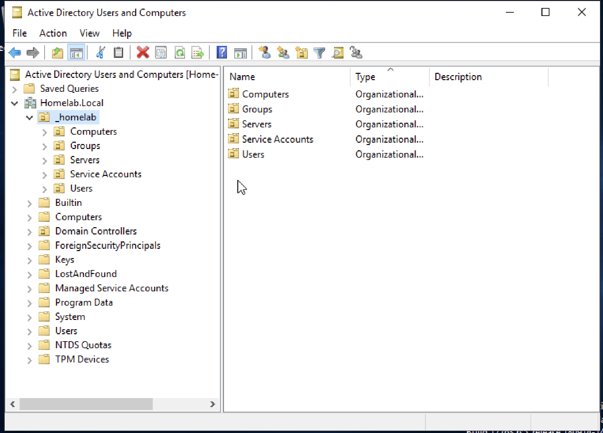
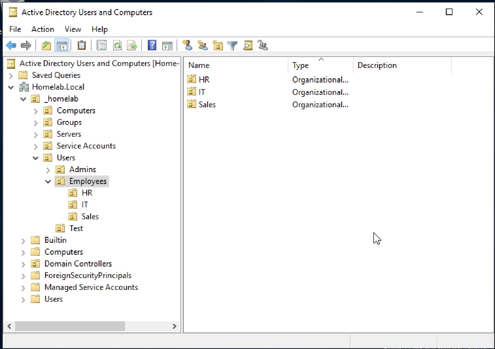
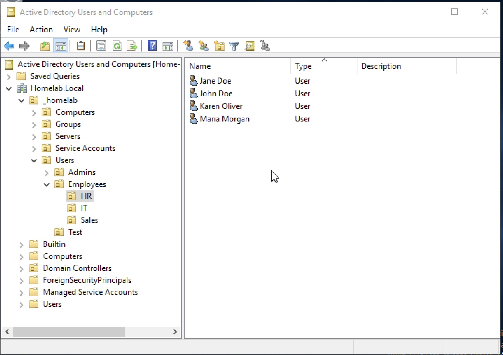
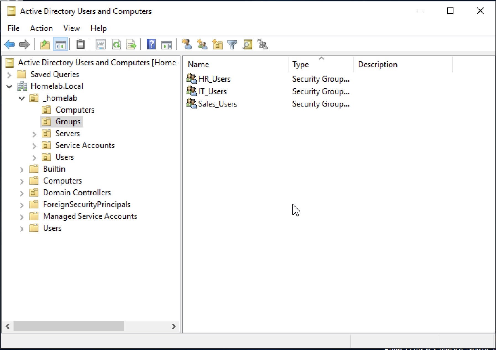
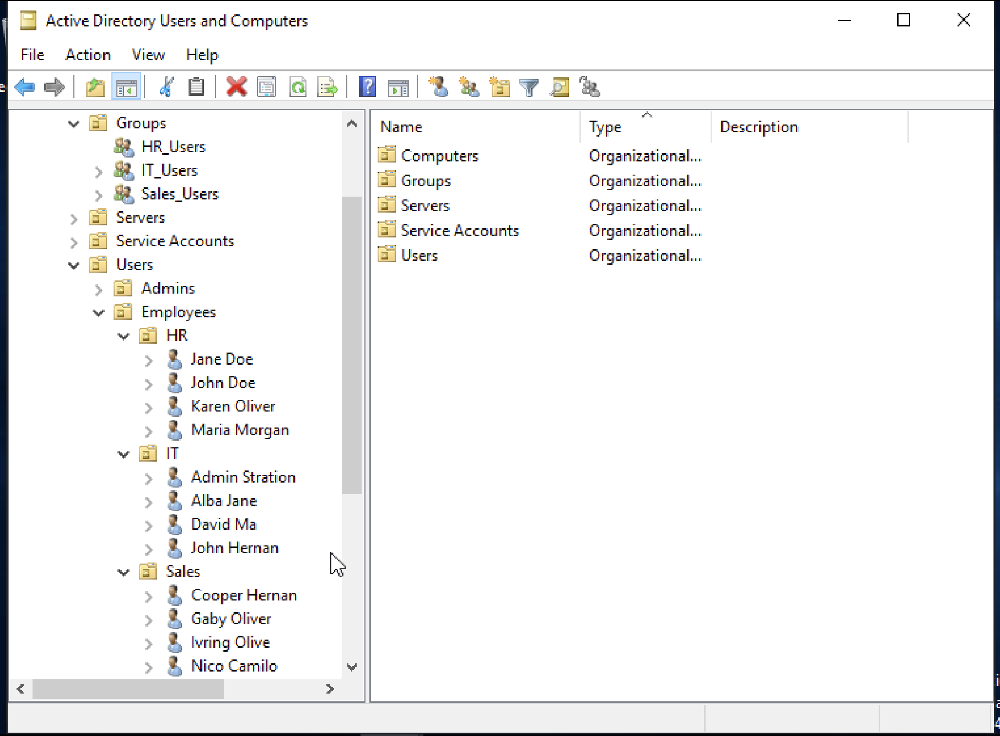

# Active Directory User & Group Management Lab

## Objective
Build a basic Active Directory environment by creating Organizational Units (OUs), users, and security groups to simulate real-world identity and access management.

---

## Lab Environment
- Windows Server 2019 Virtual Machine  
- Active Directory Domain Services (AD DS)  
- Active Directory Users and Computers (ADUC)  

---

## Skills Demonstrated
- Active Directory administration  
- Organizational Unit (OU) creation and structure  
- User account creation and management  
- Security group creation  
- Group membership management  
- Department-based organization  

---

## Step-by-Step Configuration

### 1. Start Server and Open AD Tools
Launched the Windows Server VM, opened Server Manger, and accessed Active Director Users and Computers.  

**Description:**  
Server Manager dashboard displaying installed roles including Active Directory Domain Services (AD DS) and DNS.

---

### 2. Open Active Directory Users and Computers
Opened Active Directory Users and Computers and navigated to the domain to prepare for directory structure creation.

**Description:**  
Active Directory Users and Computers console showing the domain structure with default folders and organizational containers.

---

### 3. Create Organizational Units (OUs)
Created an Organizational Units for HR, IT, and Sales to organize users and administration by department. 

**Description:**  
Active Directory Users and Computers showing newly created OUs (HR, IT, Sales) organized under the Employees container.

---

### 4. Create HR Users
Created user accounts within HR Organizational Unit.

**Description:**  
Active Directory Users and Computers displaying multiple user accounts listed under the HR OU.

---

### 5. Create IT Users
Created user accounts within IT Organizational Unit.  

**Description:**  
Active Directory Users and Computers showing user accounts created under the IT Organizational Unit for centralized identity management.

---

### 6. Create Sales Users
Created user accounts within Sales Organizational Unit. 

**Description:**  
Active Directory Users and Computers displaying user accounts under the Sales Organizational Unit to reflect department-based structure.

---

### 7. Create Security Groups
Created security groups for each department and configured them with Global scope and Security type.

**Description:**  
Active Directory Users and Computers showing security groups (HR_Users, IT_Users, Sales_Users) under the Groups Organizational Unit.

---

### 8. Add Users to Groups
Added users to their corresponding department security groups.
  - HR → HR_Users  
  - IT → IT_Users  
  - Sales → Sales_Users  

**Description:**  
Added user accounts to their respective security groups to simulate role-based administration.

---

### 9. Verify Final Structure
Reviewed the Active Directory structure to confirm proper organization of Organizational Units, users, and groups.  

**Description:**  
Final Active Directory structure showing Organizational Units, users, and security groups organized by department.

---

## Key Takeaways
- Organizational Units provide logical structure for user management  
- Separating users by department improves scalability and clarity  
- Security groups simplify administration and access control  
- Group-based management is essential for real-world environments  
